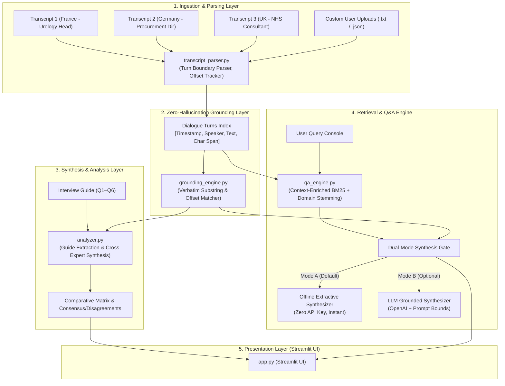

# Hasamex AI Engineer Platform: European Robotic Surgery Market Intelligence

An end-to-end healthcare transcript analysis platform designed for qualitative research synthesis. It analyzes expert interview transcripts, answers interview guide questions with 100% verified verbatim quotes and timestamps, extracts consensus themes and market disagreements, and enables interactive cross-transcript Q&A with strict zero-hallucination guarantees.

---

## Table of Contents
1. [Quick Start & Local Run](#quick-start--local-run)
2. [Project Architecture](#project-architecture)
3. [Core Capabilities](#core-capabilities)
4. [Technical Assessment Questions (Technical Round Prep)](#technical-assessment-questions-technical-round-prep)
   - [Architecture Overview](#1-architecture-overview)
   - [Model Choice & Trade-offs](#2-model-choice--trade-offs)
   - [Citations & Timestamp Alignment](#3-citations--timestamp-alignment)
   - [Hallucination Reduction Pipeline](#4-hallucination-reduction-pipeline)
   - [Scaling from 3 to 30+ Transcripts](#5-scaling-from-3-to-30-transcripts)
5. [Automated Test Suite](#automated-test-suite)
6. [Repository Structure](#repository-structure)

---

## Quick Start & Local Run

### Prerequisites
- Python 3.9+ (Python 3.10–3.13 supported)

### 1. Install Dependencies
```bash
pip install -r requirements.txt
```

### 2. Run the Streamlit Application
```bash
streamlit run app.py
```
The application will launch at `http://localhost:8501`.

> **Zero API Key Needed Out-of-the-Box**: The application defaults to the **Offline Verified Engine**, which runs instantly and deterministically without requiring any paid API keys or network access. An optional **LLM-Augmented Engine** is available in the sidebar if an OpenAI API key is supplied.

### 3. Run Automated Tests
```bash
pytest test_app.py -v
```

---

## Project Architecture



---

## Core Capabilities

1. **Structured Transcript Ingestion (`transcript_parser.py`)**:
   - Parses unstructured dialogue transcripts into structured speaker turns with timestamps (`MM:SS`), line numbers, and character span offsets.
   - Handles default pre-loaded case files as well as custom drag-and-drop file uploads.

2. **Interview Guide Question Answering (`analyzer.py`)**:
   - Answers all 6 interview guide questions for Dr. Jean Martin (France), Anna Keller (Germany), and Dr. Emily Carter (UK).
   - Extracts exact verbatim quotes with source timestamp badges and speaker attribution.

3. **Cross-Transcript Synthesis & Disagreement Detection**:
   - **Common Themes (Consensus)**: Tiered adoption, surgeon training bottleneck, capital budget scrutiny, and positive mid-term procedure growth.
   - **Regional Disagreements**:
     - *Decisive Driver*: Pure Finance/ROI (France & Germany) vs. Balanced NHS Clinical Strategy (UK).
     - *Primary Barrier*: Capital cost & volume proof (France & Germany) vs. Theatre workforce training capacity (UK).
     - *Decision Timelines*: 6–9 months (UK) vs 6–12 months (France) vs 9–18 months (Germany).
     - *Growth Outlook*: Conservative single-to-low-double digits (Germany) vs >15–20% (France & UK).
   - **Executive Comparison Matrix**: Tabular comparison with one-click CSV/Markdown export.

4. **Interactive Cross-Transcript Q&A (`qa_engine.py`)**:
   - Search across all expert calls with relevance scoring.
   - Context-enriched indexing binds interviewer prompts to expert responses, ensuring queries about timelines or barriers accurately return the expert's answer.
   - Refusal mechanism for out-of-domain queries to prevent speculative hallucinations.

---

## Technical Assessment Questions (Technical Round Prep)

During the technical interview, use the **🏛️ Architecture & Scaling Demo** tab in the app or this section to present:

### 1. Architecture Overview
- **Modular Pipeline**: Decouples document ingestion (`transcript_parser.py`), citation verification (`grounding_engine.py`), synthesis (`analyzer.py`), and interactive retrieval (`qa_engine.py`).
- **Traceable Data Model**: Every sentence in the index maintains direct pointers to its parent turn, timestamp, and raw character span.

### 2. Model Choice & Trade-offs
| Engine / Model | Latency | Determinism / Traceability | Cost | Best Use Case |
| :--- | :--- | :--- | :--- | :--- |
| **Deterministic Extractive BM25 (Default)** | **< 15 ms** | **100% Verifiable, Zero-Drift** | **$0.00 (Zero Key)** | Immediate baseline out-of-the-box demo, exact quote alignment, offline deployment |
| **OpenAI GPT-4o-mini (Augmented)** | ~400 ms | High (with strict prompt constraints) | < $0.001 / query | Fluid executive synthesis, multi-turn conversational nuance |
| **Local Open-Source (LLaMA-3.1 8B via vLLM)** | ~250 ms | High | Local compute | On-premise enterprise deployment where transcripts cannot leave HIPAA/GDPR boundaries |

*Why this design?* In expert healthcare market research, precision and auditable citations take precedence over creative speculation. Providing a zero-dependency deterministic engine guarantees that the platform works reliably in any environment without API quota failures.

### 3. Citations & Timestamp Alignment
- **Turn-Level Boundary Parsing**: Detects timestamp markers (`MM:SS`) and associates subsequent dialogue blocks with the originating speaker.
- **Context-Enriched Indexing**: In interviews, key topic keywords often appear in the interviewer's question rather than the expert's response (e.g. interviewer asks *"How long does a purchase decision normally take?"* and the expert replies *"Six to twelve months..."*). Our parser binds the interviewer's prompt as context for the expert turn, enabling search queries for "decision timeline" to accurately surface the expert's response.
- **Verbatim Substring Audit**: Quotes pass through normalized substring verification (`normalize_text()`) to ensure exact character matching against the source text.

### 4. Hallucination Reduction Pipeline
1. **Automated Verbatim Audit**: Every quote produced is programmatically verified against the raw transcript. Non-verbatim claims are flagged or rejected.
2. **Strict Prompt Bounding**: LLM instructions demand that answers be derived strictly from provided transcript excerpts, with explicit instructions to report *"Not mentioned in transcript"* when information is absent.
3. **Low Temperature Sampling**: Locked at `temperature=0.1` to prevent stochastic drift.
4. **Out-of-Domain Refusal**: Unrelated queries (e.g., rainfall in the Sahara) fall below confidence thresholds and trigger an explicit refusal rather than fabricated answers.

### 5. Scaling from 3 to 30+ Transcripts
To scale from 3 calls to an enterprise repository of 30 to 100+ transcripts:
- **Vector Database**: Migrate to `pgvector` or `Qdrant` with hybrid dense-sparse search (combining BM25 with `text-embedding-3-large`).
- **Hierarchical Map-Reduce Synthesis**:
  1. *Map Step*: Extract structured answers and quotes per guide question for each call.
  2. *Clustering Step*: Group transcripts by market (UK, DACH, France) and stakeholder persona (Procurement, Urology Head, Hospital CEO).
  3. *Reduce Step*: Aggregate consensus and outliers across clusters to generate market-wide statistical distributions (e.g., *"75% of German procurement directors cite TCO as barrier #1"*).
- **Quantitative Attribute Extraction**: Extract key metrics (`timeline_months_min`, `timeline_months_max`, `growth_pct_estimate`, `primary_barrier_tag`) into an OLAP table to power quantitative dashboards alongside qualitative verbatim quotes.
- **Asynchronous ETL Queue**: Process uploads via Celery/Redis background workers with WhisperX for word-level audio-to-text timestamp alignment.

---

## Automated Test Suite

Run the full pytest suite:
```bash
pytest test_app.py -v
```

### Covered Test Cases:
- `test_transcript_loading`: Confirms 3 files load with complete data.
- `test_transcript_metadata`: Verifies expert names, roles, and countries.
- `test_turn_timestamps_and_offsets`: Validates timestamp formats and character spans.
- `test_quote_verification_exact`: Checks 100% verbatim quote matches for France, Germany, and UK.
- `test_quote_verification_rejects_hallucination`: Confirms rejection of fabricated statements.
- `test_guide_questions_count`: Verifies all 6 guide questions are mapped.
- `test_expert_answers_and_citations`: Validates quotes and timestamps for each question.
- `test_comparative_matrix_dataframes`: Verifies comparison matrix construction.
- `test_qa_search_relevant_results`: Verifies BM25 search relevance.
- `test_qa_offline_answers`: Verifies zero-key grounded answer generation.
- `test_qa_irrelevant_query_handling`: Confirms refusal of out-of-domain questions.

---

## Repository Structure

```
.
├── src/
│   ├── __init__.py
│   ├── parsers/
│   │   ├── __init__.py
│   │   └── transcript_parser.py    # Ingestion, dialogue turns & QAUnit segmentation
│   ├── validators/
│   │   ├── __init__.py
│   │   └── grounding_validator.py  # StructuralGroundingValidator & Citation audit
│   └── engines/
│       ├── __init__.py
│       ├── analyzer.py             # Guide question synthesis & cross-market consensus
│       └── qa_engine.py            # Context-enriched BM25 & LLM retrieval Q&A
├── input_transcripts/              # Zero-config auto-discovery folder for calls
│   ├── Transcript_1_France.txt
│   ├── Transcript_2_Germany.txt
│   └── Transcript_3_UK.txt
├── app.py                          # Streamlit interactive application
├── test_app.py                     # Automated pytest test suite (16 tests)
├── Interview_Guide.txt             # 6 standard research questions
├── README.md                       # Comprehensive documentation & demo guide
├── requirements.txt                # Python dependencies
└── .env.example                    # Reference configuration template
```
